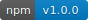

# vue-canvas-sign
[](https://www.npmjs.com/package/vue-canvas-sign)
> vue canvas签名组件（vue canvas sign component）  
### 示例
> [demo展示](https://jekorx.github.io/vue-canvas-sign)


### 用法
```bash
# 安装依赖
yarn add vue-canvas-sign
# or
npm i vue-canvas-sign -S
```
> 使用
```javascript
<template>
  <div>
    <CanvasSign ref="canvasSign" />
    <div>
      <button @click="save">save</button>
      <button @click="clear">clear</button>
    </div>
    
  </div>
</template>
<script>
import CanvasSign from '../canvas-sign'

export default {
  components: { CanvasSign },
  data () {
    return {
      imgSrc: 'data:image/png;base64,iVBORw0KGgoAAAANSUhEUgAAAAEAAAABCAYAAAAfFcSJAAAAC0lEQVQYV2NgAAIAAAUAAarVyFEAAAAASUVORK5CYII='
    }
  },
  methods: {
    save () {
      this.$refs.canvasSign.save(img => {
        this.imgSrc = img
      })
    },
    clear () {
      this.$refs.canvasSign.clear()
    }
  }
}
</script>
```
### 参数
| 参数          | 说明       | 类型    |  默认值 |
| :------------ | :--------  | :------ | :----- |
| width         | 画布宽     | Number  | document.documentElement.clientWidth &vert;&vert; document.body.clientWidth |
| height        | 画布高     | Number  | 200 |
| lineWidth     | 画线粗细   | Number  | 2 |
| color         | 画线颜色   | String  | '#000' |
| background    | 画布背景色 | String  | 'rgba(255, 255, 255, 0)' |
| borderWidth   | 边框宽度   | Number  | 1 |
| borderColor   | 边框颜色   | String  | '#333' |
