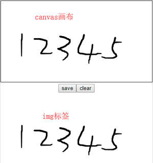

# vue-canvas-sign

[](https://www.npmjs.com/package/vue-canvas-sign)

> ❗ vue canvas签名组件（vue canvas sign component），```2.x```版本为```vue@3.x```组件  

> ❗ 如需在```vue@2.x```中使用，请使用 [](https://www.npmjs.com/package/vue-canvas-sign/v/1.0.4)，Github v1.x地址 [](https://github.com/jekorx/vue-canvas-sign/tree/1.x)  
> ```yarn add vue-canvas-sign@^1.0.4```  
> ```npm i vue-canvas-sign@^1.0.4 -S```  

### 示例

> [demo展示](https://jekorx.github.io/vue-canvas-sign)  



### 用法

```bash
# 安装依赖
yarn add vue-canvas-sign
# or
npm i vue-canvas-sign -S
```

> 使用  

```javascript
<template>
  <div>
    <!-- 使用方法一 -->
    <CanvasSign ref="canvasSign" :imageQual="0.01" background="#FFF" />
    <div>
      <button @click="saveHandle">save</button>
      <button @click="clearHandle">clear</button>
    </div>
    <hr />
    <!-- 使用方法二 -->
    <CanvasSign>
      <template v-slot="{ save, clear }">
        <button @click="() => save(saveCallback)">save</button>
        <button @click="() => clearWithSlotHandle(clear)">clear</button>
      </template>
    </CanvasSign>
    <hr />
    <!-- 生成图片展示 -->
    
  </div>
</template>
<script lang="ts">
import { defineComponent, ref } from 'vue'
import CanvasSign, { ICanvasSign } from './canvas-sign'

const blankimg = 'data:image/png;base64,iVBORw0KGgoAAAANSUhEUgAAAAEAAAABCAYAAAAfFcSJAAAAC0lEQVQYV2NgAAIAAAUAAarVyFEAAAAASUVORK5CYII='
export default defineComponent({
  components: { CanvasSign },
  setup () {
    const imgSrc = ref(blankimg)
    const canvasSign = ref<ICanvasSign>()

    // slot中save方法回调
    const saveCallback = (imgBase64?: string) => {
      imgSrc.value = imgBase64 || blankimg
    }
    // 不使用slot的save方法
    const saveHandle = () => {
      canvasSign.value?.save(img => {
        imgSrc.value = img || blankimg
      })
    }
    // 不使用slot的clear方法
    const clearHandle = () => {
      canvasSign.value?.clear() // 清空图片
      imgSrc.value = blankimg // 清空画布
    }
    // 使用slot的clear方法
    const clearWithSlotHandle = (clear: () => void) => {
      clear && clear() // 清空画布
      imgSrc.value = blankimg // 清空图片
    }

    return {
      canvasSign,
      imgSrc,
      saveCallback,
      saveHandle,
      clearHandle,
      clearWithSlotHandle
    }
  }
})
</script>

/** 
 * 注册全局组件
 */
import CanvasSign from 'vue-canvas-sign'

app.component('CanvasSign', CanvasSign)
// or
//app.use(CanvasSign)
```

### 组件参数

| 参数          | 说明       | 类型    |  默认值 |  可选值 |
| :------------ | :--------  | :------ | :----- | :----- |
| width         | 画布宽     | Number  | document宽度 | |
| height        | 画布高     | Number  | ```200``` | |
| lineWidth     | 画线粗细   | Number  | ```2``` | |
| color         | 画线颜色   | String  | ```#000``` | |
| background    | 画布背景色 | String  | ```rgba(255, 255, 255, 0)``` | |
| borderWidth   | 边框宽度   | Number  | ```1``` | |
| borderColor   | 边框颜色   | String  | ```#333``` | |
| imageType     | 生成图片类型，使用```image/jpeg```类型，注意修改```background```，清空画布再次绘制可能无法正常生成base64，所以不推荐使用使用```image/jpeg```类型 | String  | ```image/png```（👍推荐🔥） | ```image/png``` &#124; ```image/jpeg``` &#124; ```image/webp```(Chrome支持) |
| imageQual     | 生成图片质量，imageType为```image/jpeg```时生效 | Number  | ```0.92``` | ```0 ~ 1``` 之间数字 |

### slot

| 属性   | 说明        | 类型      |  参数 |
| :----- | :---------- | :------- | :----- |
| save   | 保存图片方法，需判断imgBase64是否为空 | Function | callback(imgBase64?: string) |
| clear  | 清空画布方法 | Function | 无 |
